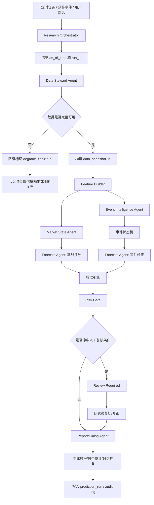
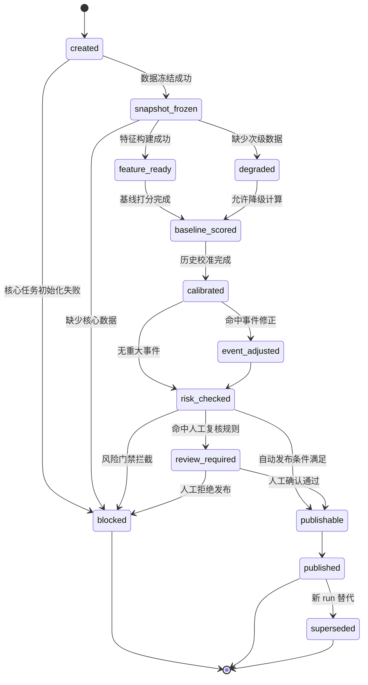

# Agent Workflow图与预测状态机

生成日期：2026-05-29

关联文档：
- [AI赋能成品油研究-12席专家圆桌总方案.md](</E:/中鲁燃能/AI赋能成品油研究-12席专家圆桌总方案.md>)
- [P0数据字典与采集清单.md](</E:/中鲁燃能/P0数据字典与采集清单.md>)
- [成品油研究智能体系统V1-技术细化.md](</E:/中鲁燃能/成品油研究智能体系统V1-技术细化.md>)
- [sql/v1_schema.sql](</E:/中鲁燃能/sql/v1_schema.sql>)

## 1. 文档目的

这份文档只回答三个问题：

1. Agent 集群具体怎么分工
2. 一次预测 run 从数据到发布是怎么跑的
3. 预测结论在系统里有哪些状态，什么时候自动发布，什么时候必须人工复核

## 2. 设计原则

V1 的 Agent 设计遵守下面 6 条原则：

1. `主控编排，不自由群聊`
2. `先冻结数据，再生成结论`
3. `LLM 只做理解、解释、抽取，不做最终定价`
4. `同一 run 的上下文不可漂移`
5. `红橙事件强制人工复核`
6. `每次再预测都必须沉淀为可回放的 run`

## 3. Agent清单

## 3.1 最小集群

V1 采用 `5+1` 集群：

1. `Research Orchestrator`
2. `Data Steward Agent`
3. `Market State Agent`
4. `Event Intelligence Agent`
5. `Forecast Agent`
6. `Report/Dialog Agent`
7. `Alert Agent`

## 3.2 职责表

| Agent | 触发时机 | 输入 | 输出 | 是否可改价格结论 |
|---|---|---|---|---|
| `Research Orchestrator` | 所有 run 的入口 | 用户请求/定时任务/预警事件 | `run_id`、执行计划、上下文冻结结果 | N |
| `Data Steward Agent` | run 初始化 | ODS 原始数据、采集状态、数据规则 | `data_snapshot_id`、异常清单、可用数据包 | N |
| `Market State Agent` | 数据通过质检后 | 山东地炼、主营、区域、供需、物流特征 | 市场状态标签、主链状态摘要 | N |
| `Event Intelligence Agent` | 新闻/预警触发或常规 run | 成品油新闻、政策、天气、事故、物流事件 | 事件结构化结果、事件级别、影响方向 | N |
| `Forecast Agent` | 基线预测与重算 | 特征快照、规则版本、事件修正参数 | 趋势、点位、区间、价差、因子贡献 | Y，但只能通过规则/模型引擎 |
| `Report/Dialog Agent` | 晨报、快评、对话 | 结构化结论、证据链、场景参数 | 晨报草稿、盘中快评、对话答复 | N |
| `Alert Agent` | 常驻或事件触发 | 价格跳变、新闻、预警、模型偏差 | 预警等级、触发动作、重算请求 | N |

## 4. 统一运行上下文

每个 run 必须冻结以下上下文：

| 字段 | 说明 |
|---|---|
| `run_id` | 本次运行唯一编号 |
| `run_type` | `scheduled_daily` / `event_rerun` / `scenario_rerun` / `manual_publish` |
| `as_of_time` | 本次预测基准时点 |
| `data_snapshot_id` | 数据快照编号 |
| `feature_version` | 特征版本 |
| `rule_version` | 打分规则版本 |
| `calibration_version` | 校准模型版本 |
| `event_pack_version` | 事件包版本 |
| `prompt_version` | LLM 提示词版本 |
| `operator` | 发起人或系统任务名 |

没有这几个字段，run 不能进入预测环节。

## 5. Agent Workflow 总图



## 6. 四条主工作流

## 6.1 每日晨报工作流

### 触发

- 固定时间，建议 `07:00` 开始采集，`07:20` 冻结快照，`07:30` 前出稿

### 流程

1. `Research Orchestrator` 创建 `scheduled_daily` run
2. `Data Steward Agent` 拉取截至早晨的全部有效数据
3. 生成 `data_snapshot_id`
4. 构建 `feature_snapshot`
5. `Market State Agent` 输出今晨状态：
   - 汽油偏强 / 偏弱
   - 柴油偏强 / 偏弱
   - 山东强于周边 / 弱于周边
   - 套利打开 / 关闭
6. `Event Intelligence Agent` 汇总过去 24 小时事件
7. `Forecast Agent` 输出：
   - 山东 92# / 0# `T+0/T+1/T+3` 趋势
   - 点位与区间
   - 区域传导
   - 裂解价差 / 基差
8. `Risk Gate` 判断是否需要人工复核
9. `Report/Dialog Agent` 生成晨报草稿
10. 研究员确认后发布

## 6.2 盘中预警工作流

### 触发

以下任一条件命中即启动：

1. 山东主流价格跳变超过阈值
2. 成品油相关新闻命中高权重词典
3. 重大政策/事故/封航/封路
4. 模型预测与实际偏差超阈值

### 流程

1. `Alert Agent` 生成预警事件
2. `Research Orchestrator` 创建 `event_rerun`
3. `Event Intelligence Agent` 重新归类事件
4. `Forecast Agent` 做增量重算
5. 若预警等级为 `orange` 或 `red`，转 `Review Required`
6. `Report/Dialog Agent` 自动生成盘中快评草稿

## 6.3 对话式再预测工作流

### 触发

用户在对话框发起：

1. 解释类问题
2. 情景类问题
3. 重算类问题

### 分类

| 问题类型 | 例子 | 动作 |
|---|---|---|
| `explain` | 为什么今天山东 92# 偏强 | 读取已发布结果，不重算 |
| `scenario` | 如果运费上升 80 元/吨，河南落地价会怎样 | 创建 `scenario_rerun` |
| `rerun_with_event` | 把新出的炼厂停工消息加进去重算一版 | 创建 `event_rerun` |

### 流程

1. `Report/Dialog Agent` 解析意图
2. `Research Orchestrator` 获取最新有效上下文
3. 若有新假设，生成 `scenario_inputs`
4. `Forecast Agent` 基于假设重算
5. `Report/Dialog Agent` 返回：
   - 哪些输入被改了
   - 新旧预测差异
   - 影响最大的变量
   - 是否触发风险升级

## 6.4 人工修正工作流

### 触发

1. 红橙预警事件
2. 数据源冲突
3. 实际成交与模型差异过大
4. 研究员确认市场存在“模型尚未覆盖”的异常

### 流程

1. run 进入 `review_required`
2. 研究员填写修正原因和证据
3. 如果涉及价格或预警级别变化，必须写 `manual_override_log`
4. 复核人确认后重新发布
5. 系统保留原始模型结论和修正后结论两版

## 7. 预测状态机

## 7.1 状态图



## 7.2 状态解释

| 状态 | 含义 | 是否允许展示 | 是否允许正式发布 |
|---|---|---|---|
| `created` | run 已创建 | N | N |
| `snapshot_frozen` | 已冻结快照 | N | N |
| `feature_ready` | 特征构建完成 | N | N |
| `degraded` | 次级数据缺失，采用降级策略 | Y | 仅低置信度 |
| `baseline_scored` | 基线打分完成 | N | N |
| `calibrated` | 校准完成 | N | N |
| `event_adjusted` | 事件修正完成 | N | N |
| `risk_checked` | 已过风险门禁 | N | N |
| `review_required` | 需要人工复核 | Y | N |
| `publishable` | 满足发布条件 | Y | Y |
| `published` | 已正式发布 | Y | Y |
| `blocked` | 被系统或人工阻断 | N | N |
| `superseded` | 已被新版本替代 | Y | 历史可查 |

## 8. 转移规则

## 8.1 自动进入 `degraded`

以下情况允许降级，但必须明示低置信度：

1. 重点区域落地价缺失，但山东主链完整
2. 物流运费缺失，采用最近一期有效值
3. 非核心新闻源暂时中断

## 8.2 自动进入 `blocked`

以下情况必须阻断：

1. 山东地炼主链价格缺失
2. 山东主营批发价缺失且无最近可用有效版本
3. `orange` / `red` 事件未人工确认
4. 数据口径冲突未解决

## 8.3 自动进入 `review_required`

以下任一命中即转人工复核：

1. 黑天鹅、地缘、重大政策
2. 山东重点炼厂事故/非计划停车
3. 价格单日偏离近 20 日波动带显著超阈值
4. 模型输出与规则基线差异过大
5. 研究员主动要求人工签发

## 9. 预测引擎在流程中的位置

为了避免误解，单独说清楚：

`Forecast Agent` 不是一个自由生成数字的 LLM agent。

它只负责调用下面 4 个可复现模块：

1. `rule_score_engine`
2. `stat_calibration_engine`
3. `event_adjustment_engine`
4. `range_builder`

也就是说：

`Agent 负责调度与解释，规则/模型负责出数。`

## 10. 输入输出契约

## 10.1 Forecast Agent 输入

```json
{
  "run_id": "pred_20260529_072000_sd",
  "as_of_time": "2026-05-29T07:20:00+08:00",
  "data_snapshot_id": "snap_20260529_0720",
  "feature_version": "v1.0.0",
  "rule_version": "shandong_scorecards_v1",
  "calibration_version": "gbdt_residual_v1",
  "target_scope": [
    "SD_GAS92_D1",
    "SD_DIESEL0_D1",
    "SD_GAS92_D3",
    "SD_DIESEL0_D3"
  ],
  "event_pack": [
    "evt_refinery_maintenance_001",
    "evt_port_weather_003"
  ],
  "scenario_inputs": {}
}
```

## 10.2 Forecast Agent 输出

```json
{
  "run_id": "pred_20260529_072000_sd",
  "results": [
    {
      "target": "SD_GAS92_D1",
      "direction_label": "up",
      "point_value": 6885.0,
      "range_lower": 6840.0,
      "range_upper": 6910.0,
      "confidence_label": "medium",
      "confidence_score": 0.74,
      "degrade_flag": false
    }
  ],
  "factor_breakdown": [
    {
      "target": "SD_GAS92_D1",
      "factor_group": "cost",
      "factor_name": "brent_change_usd_d1",
      "contribution": 22.0
    }
  ]
}
```

## 11. V1 推荐实施顺序

1. 先跑通 `scheduled_daily`
2. 再接 `event_rerun`
3. 再做 `scenario_rerun`
4. 最后补 `manual_publish` 和完整复核台账

不要一开始就同时上 4 条链，否则排障会非常混乱。

## 12. 这份文档对开发的直接意义

开发可以直接按这份文档拆 4 类工作：

1. `run 上下文冻结`
2. `Agent 输入输出协议`
3. `状态机持久化`
4. `人工复核入口`

如果这四块按这里实现，V1 的晨报、预警、对话式再预测就能共用同一套主链，而不会做成三套分裂系统。

