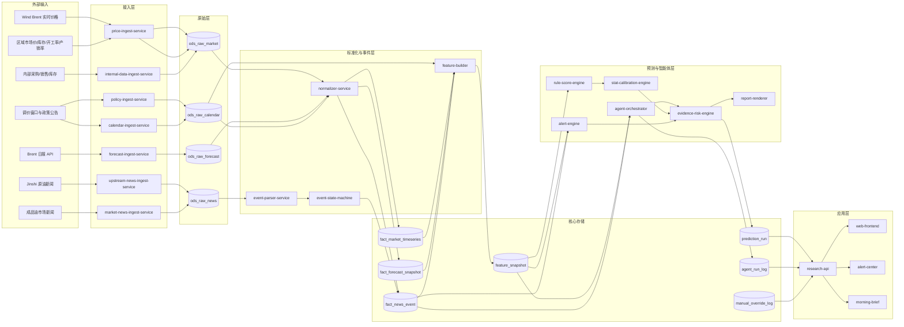
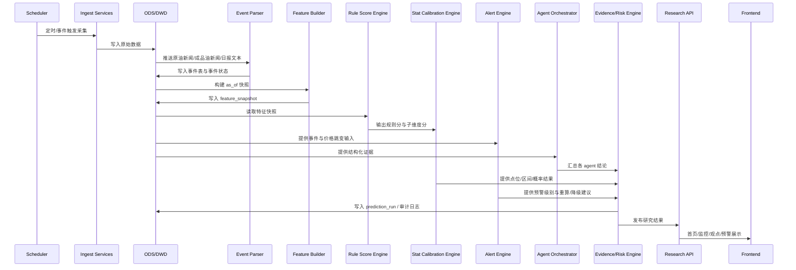
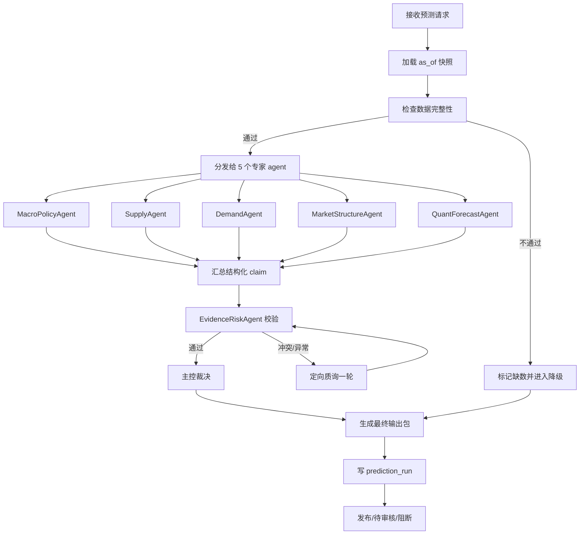

# 成品油研究智能体系统 V1 技术细化

生成日期：2026-05-28
关联文档：[成品油研究智能体系统V1方案.md](</E:/中鲁燃能/成品油研究智能体系统V1方案.md>)

## 1. 文档目标

这份文档把上一版方案继续压实到可开发层，覆盖三部分：

1. 系统架构图
2. 表结构 / 字段清单
3. Agent workflow

适用对象：

1. 后端开发
2. 数据开发
3. 算法 / 量化
4. 前端开发
5. 产品 / 研究负责人

## 2. 设计原则

V1 一律遵守以下原则：

1. 同因子同结果
2. point-in-time correct
3. 规则与模型解耦
4. 预测与解释分离
5. 研究与业务动作分层
6. 人工修正不覆盖审计
7. 子 agent 不自由互聊，只接受主控调度

## 3. 系统架构图

### 3.1 逻辑架构图



### 3.2 运行时序图



### 3.3 服务边界

| 服务 | 职责 | 输入 | 输出 | 部署建议 |
|---|---|---|---|---|
| `price-ingest-service` | 采集 Wind、国内成品油价格、库存、开工率、产销率等结构化数据 | Wind API / 商业数据 / CSV / 内部表 | ODS 原始价格与基本面 | 定时 + 长驻 |
| `forecast-ingest-service` | 拉取 Brent 日报 | 日报 API | ODS 原始预测 | 定时 |
| `upstream-news-ingest-service` | 拉取上游原油新闻 | Jinshi skill/API | ODS 原始新闻 | 定时 |
| `market-news-ingest-service` | 拉取成品油市场新闻 | 商业资讯 / 人工导入 | ODS 原始新闻 | 定时 |
| `policy-ingest-service` | 拉取调价窗口与政策公告 | 官方站点 / 手工维护 | ODS 原始日历与政策 | 定时 |
| `internal-data-ingest-service` | 采集内部采购、销售、库存、询盘 | 内部系统 / CSV | ODS 原始经营数据 | 定时 |
| `normalizer-service` | 标准化字段、时间、单位、实体 | ODS | DWD 明细 | 批处理 |
| `event-parser-service` | 文本拆句、实体识别、事件分类 | 原始新闻/日报 | 事件候选 | 批处理 |
| `event-state-machine` | 去重、冲突、状态迁移、衰减 | 事件候选 | 事件事实表 | 批处理 |
| `feature-builder` | 以 `as_of_time` 物化特征快照 | DWD/事件/日历 | `feature_snapshot` | 批处理 |
| `rule-score-engine` | 规则打分，沿用业务模型 | `feature_snapshot` | 子维度分、总分 | 在线/批处理均可 |
| `stat-calibration-engine` | 规则分到点位/区间/概率映射 | 规则分 + 历史参数 | 预测结果 | 在线/批处理均可 |
| `alert-engine` | 独立识别黑天鹅、跳价、传导失真并触发重算/降级 | 价格、事件、政策、已发布结论 | 预警事件与动作建议 | 在线 |
| `agent-orchestrator` | 主控调度各专家 agent | 特征、事件、上下文 | 结构化 claim | 在线 |
| `evidence-risk-engine` | 裁决、风控、降级、发布前校验 | 预测结果 + claim + alert | 最终发布结果 | 在线 |
| `research-api` | 统一对前端、预警、报表供数 | 结果库 | API | 在线 |

## 4. 核心模块拆分

### 4.1 数据域

V1 只划分七个主题域：

1. 国际原油域
2. 国内成品油价格域
3. 炼厂供给与库存域
4. 国内成品油市场新闻域
5. 政策与调价机制域
6. 内部经营域
7. 预测审计与预警域

### 4.2 代码目录建议

```text
app/
  api/
  services/
    ingest/
    normalize/
    event/
    feature/
    scoring/
    calibration/
    orchestration/
    risk/
  models/
  jobs/
  prompts/
  configs/
  tests/
data/
  dictionaries/
  mappings/
docs/
```

## 5. 表结构与字段清单

下文默认关系型数据库主存储，建议 PostgreSQL；高频行情或历史大表可后续拆到 ClickHouse。

字段类型以 PostgreSQL 风格表示。

---

## 5.1 维表

### 5.1.1 `dim_indicator`

用途：统一指标字典，避免中文口径散落代码中。

| 字段 | 类型 | 必填 | 说明 |
|---|---|---:|---|
| `indicator_id` | bigint PK | Y | 主键 |
| `indicator_code` | varchar(64) unique | Y | 如 `brent_last_usd_bbl` |
| `indicator_name` | varchar(128) | Y | 中文名 |
| `category` | varchar(32) | Y | `price/fundamental/event/forecast/calendar` |
| `sub_category` | varchar(32) | N | 细分类 |
| `unit` | varchar(32) | Y | `usd_bbl/cny_ton/pct/day/count` |
| `freq` | varchar(16) | Y | `tick/minute/hour/day/week/event` |
| `value_type` | varchar(16) | Y | `numeric/text/json` |
| `publish_lag_rule` | varchar(128) | N | 发布时间规则说明 |
| `fill_policy_default` | varchar(32) | Y | `carry_forward/no_fill/calendar_align` |
| `description` | text | N | 指标定义 |
| `is_active` | boolean | Y | 是否启用 |
| `created_at` | timestamptz | Y | 创建时间 |
| `updated_at` | timestamptz | Y | 更新时间 |

### 5.1.2 `dim_entity`

用途：统一研究对象，支持区域、产品、炼厂、国家等。

| 字段 | 类型 | 必填 | 说明 |
|---|---|---:|---|
| `entity_id` | bigint PK | Y | 主键 |
| `entity_type` | varchar(32) | Y | `region/product/refinery/country/port/route` |
| `entity_code` | varchar(64) unique | Y | 如 `CN_SD_92#` |
| `entity_name` | varchar(128) | Y | 中文名 |
| `parent_entity_id` | bigint | N | 父级，如山东属于中国 |
| `region_level` | varchar(16) | N | `country/region/province/city` |
| `product_family` | varchar(32) | N | `gasoline/diesel` |
| `is_active` | boolean | Y | 是否启用 |
| `created_at` | timestamptz | Y | 创建时间 |
| `updated_at` | timestamptz | Y | 更新时间 |

### 5.1.3 `dim_source`

| 字段 | 类型 | 必填 | 说明 |
|---|---|---:|---|
| `source_id` | bigint PK | Y | 主键 |
| `source_code` | varchar(64) unique | Y | `wind/agi_report/jinshi/manual` |
| `source_name` | varchar(128) | Y | 数据源名称 |
| `source_type` | varchar(32) | Y | `api/file/manual/agent` |
| `priority` | integer | Y | 同指标多源优先级 |
| `sla_level` | varchar(16) | N | `high/medium/low` |
| `owner_team` | varchar(64) | N | 数据源负责人 |
| `is_active` | boolean | Y | 是否启用 |
| `created_at` | timestamptz | Y | 创建时间 |
| `updated_at` | timestamptz | Y | 更新时间 |

---

## 5.2 ODS 原始层

### 5.2.1 `ods_raw_market`

| 字段 | 类型 | 必填 | 说明 |
|---|---|---:|---|
| `raw_id` | bigint PK | Y | 主键 |
| `source_id` | bigint | Y | 数据源 |
| `source_record_id` | varchar(128) | Y | 源侧记录唯一键 |
| `topic` | varchar(64) | Y | `wind_price` 等 |
| `source_event_time` | timestamptz | N | 源业务时间 |
| `ingest_time` | timestamptz | Y | 入库时间 |
| `payload` | jsonb | Y | 原始回包 |
| `payload_hash` | varchar(64) | Y | 去重辅助 |
| `dt` | date | Y | 分区日期 |

### 5.2.2 `ods_raw_forecast`

| 字段 | 类型 | 必填 | 说明 |
|---|---|---:|---|
| `raw_id` | bigint PK | Y | 主键 |
| `source_id` | bigint | Y | 数据源 |
| `report_date` | date | Y | 报告日期 |
| `report_title` | varchar(256) | N | 标题 |
| `source_record_id` | varchar(128) | Y | 源侧记录键 |
| `fetched_at` | timestamptz | Y | 抓取时间 |
| `payload` | jsonb | Y | 原始 JSON |
| `markdown_body` | text | N | 原始 markdown |
| `payload_hash` | varchar(64) | Y | 去重辅助 |
| `dt` | date | Y | 分区日期 |

### 5.2.3 `ods_raw_news`

| 字段 | 类型 | 必填 | 说明 |
|---|---|---:|---|
| `raw_id` | bigint PK | Y | 主键 |
| `source_id` | bigint | Y | 数据源 |
| `source_record_id` | varchar(128) | Y | 新闻 id |
| `publish_time` | timestamptz | Y | 发布时间 |
| `title` | text | N | 标题 |
| `content` | text | Y | 正文 |
| `author` | varchar(128) | N | 来源作者 |
| `payload` | jsonb | Y | 原始 JSON |
| `payload_hash` | varchar(64) | Y | 去重辅助 |
| `ingest_time` | timestamptz | Y | 入库时间 |
| `dt` | date | Y | 分区日期 |

### 5.2.4 `ods_raw_calendar`

| 字段 | 类型 | 必填 | 说明 |
|---|---|---:|---|
| `raw_id` | bigint PK | Y | 主键 |
| `calendar_type` | varchar(32) | Y | `price_window/holiday/trading_day` |
| `calendar_date` | date | Y | 日期 |
| `payload` | jsonb | Y | 原始信息 |
| `source_id` | bigint | Y | 来源 |
| `ingest_time` | timestamptz | Y | 入库时间 |
| `dt` | date | Y | 分区日期 |

---

## 5.3 DWD 事实层

### 5.3.1 `fact_market_timeseries`

这是最核心的标准时序表。

| 字段 | 类型 | 必填 | 说明 |
|---|---|---:|---|
| `ts_id` | bigint PK | Y | 主键 |
| `indicator_id` | bigint | Y | 指标 |
| `entity_id` | bigint | Y | 实体 |
| `observation_time` | timestamptz | Y | 该值代表的业务时点 |
| `publish_time` | timestamptz | Y | 该值对系统可见时间 |
| `freq` | varchar(16) | Y | 频率 |
| `value_num` | numeric(20,6) | N | 数值型值 |
| `value_text` | text | N | 文本型值 |
| `unit` | varchar(32) | Y | 单位 |
| `currency` | varchar(16) | N | 币种 |
| `source_id` | bigint | Y | 来源 |
| `source_record_id` | varchar(128) | Y | 源记录 |
| `is_final` | boolean | Y | 是否终值 |
| `revision_no` | integer | Y | 修订版本 |
| `quality_flag` | varchar(16) | Y | `ok/missing/outlier/revised` |
| `effective_from` | timestamptz | Y | 生效开始 |
| `effective_to` | timestamptz | N | 生效结束 |
| `ingest_time` | timestamptz | Y | 入库时间 |
| `dt` | date | Y | 分区 |

联合唯一键建议：

`(indicator_id, entity_id, observation_time, revision_no, source_id)`

### 5.3.2 `fact_forecast_snapshot`

用于保存报告中抽取出的结构化预测。

| 字段 | 类型 | 必填 | 说明 |
|---|---|---:|---|
| `forecast_id` | bigint PK | Y | 主键 |
| `indicator_id` | bigint | Y | 预测对象 |
| `entity_id` | bigint | Y | 实体 |
| `forecast_target_time` | timestamptz | Y | 目标时点 |
| `forecast_horizon` | varchar(16) | Y | `D1/D3/W1/M1` |
| `forecast_direction` | varchar(16) | N | `up/down/flat` |
| `forecast_point` | numeric(20,6) | N | 点位 |
| `forecast_lower` | numeric(20,6) | N | 区间下沿 |
| `forecast_upper` | numeric(20,6) | N | 区间上沿 |
| `support_level` | numeric(20,6) | N | 支撑位 |
| `resistance_level` | numeric(20,6) | N | 阻力位 |
| `confidence_label` | varchar(16) | N | `low/medium/high` |
| `issue_time` | timestamptz | Y | 报告发布时间 |
| `source_id` | bigint | Y | 来源 |
| `source_record_id` | varchar(128) | Y | 源记录 |
| `model_name` | varchar(64) | N | 来源模型名 |
| `model_version` | varchar(32) | N | 来源模型版本 |
| `raw_excerpt` | text | N | 原始摘录 |
| `ingest_time` | timestamptz | Y | 入库时间 |
| `dt` | date | Y | 分区 |

### 5.3.3 `fact_news_event`

原始事件与事件状态统一存放。

| 字段 | 类型 | 必填 | 说明 |
|---|---|---:|---|
| `event_id` | bigint PK | Y | 主键 |
| `cluster_id` | varchar(64) | Y | 同一事件聚类 id |
| `event_type` | varchar(64) | Y | 事件类型 |
| `event_state` | varchar(16) | Y | `rumored/confirmed/revised/canceled/disputed` |
| `event_time` | timestamptz | Y | 事件发生时间 |
| `publish_time` | timestamptz | Y | 首次发布时间 |
| `latest_update_time` | timestamptz | Y | 最近更新时间 |
| `source_id` | bigint | Y | 来源 |
| `source_record_id` | varchar(128) | Y | 源侧记录 |
| `title` | text | N | 标题 |
| `content` | text | Y | 正文 |
| `geo_scope` | varchar(64) | N | 地理范围 |
| `commodity_scope` | varchar(64) | N | 品类范围 |
| `core_entity_code` | varchar(64) | N | 核心实体 |
| `direction_supply` | smallint | N | `-1/0/1` |
| `direction_demand` | smallint | N | `-1/0/1` |
| `direction_price` | smallint | N | `-1/0/1` |
| `direction_crack` | smallint | N | `-1/0/1` |
| `intensity_score` | numeric(8,4) | N | 强度 |
| `confidence_score` | numeric(8,4) | N | 置信度 |
| `novelty_score` | numeric(8,4) | N | 新颖度 |
| `time_to_effect_hours` | integer | N | 生效时滞 |
| `half_life_hours` | integer | N | 半衰期 |
| `source_quality` | varchar(16) | N | 来源质量 |
| `supporting_evidence` | jsonb | N | 多条证据 |
| `raw_payload` | jsonb | N | 原始载荷 |
| `ingest_time` | timestamptz | Y | 入库时间 |
| `dt` | date | Y | 分区 |

### 5.3.4 `fact_calendar_event`

| 字段 | 类型 | 必填 | 说明 |
|---|---|---:|---|
| `calendar_id` | bigint PK | Y | 主键 |
| `calendar_type` | varchar(32) | Y | `price_window/holiday/trading_day` |
| `calendar_date` | date | Y | 日期 |
| `name` | varchar(128) | Y | 名称 |
| `region_scope` | varchar(64) | N | 范围 |
| `is_active` | boolean | Y | 是否有效 |
| `payload` | jsonb | N | 扩展信息 |
| `source_id` | bigint | Y | 来源 |
| `created_at` | timestamptz | Y | 创建时间 |

---

## 5.4 特征层

### 5.4.1 `feature_registry`

| 字段 | 类型 | 必填 | 说明 |
|---|---|---:|---|
| `feature_name` | varchar(128) PK | Y | 特征名 |
| `feature_version` | varchar(32) PK | Y | 特征版本 |
| `entity_type` | varchar(32) | Y | 适用实体 |
| `owner_team` | varchar(64) | Y | 负责人 |
| `definition_expr` | text | Y | SQL/DSL 定义 |
| `source_dependencies` | jsonb | Y | 依赖数据源 |
| `fill_policy` | varchar(32) | Y | 补齐策略 |
| `validation_rule` | jsonb | N | 校验规则 |
| `description` | text | N | 说明 |
| `is_active` | boolean | Y | 是否启用 |
| `created_at` | timestamptz | Y | 创建时间 |
| `updated_at` | timestamptz | Y | 更新时间 |

### 5.4.2 `feature_snapshot`

| 字段 | 类型 | 必填 | 说明 |
|---|---|---:|---|
| `snapshot_id` | bigint PK | Y | 主键 |
| `entity_id` | bigint | Y | 实体 |
| `as_of_time` | timestamptz | Y | 快照时点 |
| `feature_name` | varchar(128) | Y | 特征名 |
| `feature_version` | varchar(32) | Y | 特征版本 |
| `feature_value_num` | numeric(20,6) | N | 数值 |
| `feature_value_text` | text | N | 文本 |
| `data_version` | varchar(64) | Y | 数据版本 |
| `feature_def_hash` | varchar(64) | Y | 定义 hash |
| `pipeline_run_id` | varchar(64) | Y | 产出批次 |
| `quality_flag` | varchar(16) | Y | `ok/stale/missing/fallback` |
| `staleness_hours` | integer | N | 陈旧度 |
| `created_at` | timestamptz | Y | 创建时间 |

联合索引建议：

`(entity_id, as_of_time, feature_name, feature_version)`

### 5.4.3 `feature_materialization_log`

| 字段 | 类型 | 必填 | 说明 |
|---|---|---:|---|
| `pipeline_run_id` | varchar(64) PK | Y | 批次 id |
| `job_name` | varchar(64) | Y | 作业名 |
| `as_of_time` | timestamptz | Y | 目标快照时点 |
| `data_version` | varchar(64) | Y | 数据版本 |
| `code_commit` | varchar(64) | N | 代码版本 |
| `status` | varchar(16) | Y | `success/failed/partial` |
| `row_count` | integer | N | 结果行数 |
| `error_message` | text | N | 错误信息 |
| `started_at` | timestamptz | Y | 开始时间 |
| `finished_at` | timestamptz | N | 结束时间 |

---

## 5.5 预测与审计层

### 5.5.1 `prediction_run`

这是最终发布结果主表。

| 字段 | 类型 | 必填 | 说明 |
|---|---|---:|---|
| `prediction_id` | bigint PK | Y | 主键 |
| `run_id` | varchar(64) | Y | 本次预测运行 id |
| `entity_id` | bigint | Y | 实体 |
| `product_code` | varchar(32) | Y | `gas92/gas95/diesel0` |
| `region_code` | varchar(32) | Y | `SD/HB/HD/HZ/CN` |
| `horizon` | varchar(16) | Y | `D1/D3/W1/M1` |
| `prediction_type` | varchar(16) | Y | `trend/point/range/crack` |
| `as_of_time` | timestamptz | Y | 预测生成视角时间 |
| `target_start_time` | timestamptz | N | 目标起始 |
| `target_end_time` | timestamptz | N | 目标结束 |
| `direction_label` | varchar(16) | N | `up/down/flat` |
| `prob_up` | numeric(8,4) | N | 上涨概率 |
| `prob_flat` | numeric(8,4) | N | 震荡概率 |
| `prob_down` | numeric(8,4) | N | 下跌概率 |
| `point_value` | numeric(20,6) | N | 点位 |
| `range_lower` | numeric(20,6) | N | 区间下沿 |
| `range_upper` | numeric(20,6) | N | 区间上沿 |
| `crack_direction` | varchar(16) | N | 裂差方向 |
| `crack_point` | numeric(20,6) | N | 裂差点位 |
| `confidence_label` | varchar(16) | Y | `low/medium/high` |
| `confidence_score` | numeric(8,4) | Y | 数值置信度 |
| `degrade_flag` | boolean | Y | 是否降级 |
| `degrade_reason` | varchar(128) | N | 降级原因 |
| `publish_status` | varchar(16) | Y | `draft/reviewed/published/blocked` |
| `created_at` | timestamptz | Y | 创建时间 |
| `published_at` | timestamptz | N | 发布时间 |

### 5.5.2 `prediction_factor_breakdown`

| 字段 | 类型 | 必填 | 说明 |
|---|---|---:|---|
| `id` | bigint PK | Y | 主键 |
| `prediction_id` | bigint | Y | 关联预测 |
| `factor_group` | varchar(32) | Y | `cost/supply/demand/inventory/policy/event/structure` |
| `factor_name` | varchar(128) | Y | 因子名 |
| `factor_value` | numeric(20,6) | N | 原值 |
| `factor_score` | numeric(20,6) | N | 打分值 |
| `weight` | numeric(12,6) | N | 权重 |
| `contribution` | numeric(20,6) | N | 贡献 |
| `evidence_ref` | jsonb | N | 证据引用 |

### 5.5.3 `agent_run_log`

| 字段 | 类型 | 必填 | 说明 |
|---|---|---:|---|
| `agent_run_id` | bigint PK | Y | 主键 |
| `run_id` | varchar(64) | Y | 主控运行 id |
| `agent_name` | varchar(64) | Y | agent 名 |
| `agent_round` | integer | Y | 第几轮 |
| `input_context` | jsonb | Y | 输入上下文摘要 |
| `claim_json` | jsonb | N | 结构化输出 |
| `status` | varchar(16) | Y | `success/failed/skipped` |
| `started_at` | timestamptz | Y | 开始时间 |
| `finished_at` | timestamptz | N | 结束时间 |
| `error_message` | text | N | 错误信息 |

### 5.5.4 `manual_override_log`

| 字段 | 类型 | 必填 | 说明 |
|---|---|---:|---|
| `override_id` | bigint PK | Y | 主键 |
| `prediction_id` | bigint | Y | 关联预测 |
| `override_level` | varchar(8) | Y | `L1/L2/L3` |
| `before_value` | jsonb | Y | 修改前 |
| `after_value` | jsonb | Y | 修改后 |
| `reason_code` | varchar(64) | Y | 原因码 |
| `reason_text` | text | N | 说明 |
| `requested_by` | varchar(64) | Y | 发起人 |
| `approved_by` | varchar(64) | N | 审批人 |
| `approved_at` | timestamptz | N | 审批时间 |
| `created_at` | timestamptz | Y | 创建时间 |

### 5.5.5 `publish_audit_log`

| 字段 | 类型 | 必填 | 说明 |
|---|---|---:|---|
| `audit_id` | bigint PK | Y | 主键 |
| `prediction_id` | bigint | Y | 预测 id |
| `action_type` | varchar(32) | Y | `view/export/publish/cancel` |
| `actor` | varchar(64) | Y | 操作人 |
| `target_channel` | varchar(32) | N | `web/wechat/report/api` |
| `action_time` | timestamptz | Y | 操作时间 |
| `extra_payload` | jsonb | N | 扩展信息 |

### 5.5.6 `alert_event`

| 字段 | 类型 | 必填 | 说明 |
|---|---|---:|---|
| `alert_id` | bigint PK | Y | 主键 |
| `run_id` | varchar(64) | N | 关联一次预测运行，可为空 |
| `alert_code` | varchar(64) | Y | 规则编码 |
| `alert_type` | varchar(32) | Y | `price/event/policy/consistency/data_quality` |
| `alert_level` | varchar(16) | Y | `blue/yellow/orange/red` |
| `alert_status` | varchar(16) | Y | `detected/confirmed/active/cooling/cleared/canceled` |
| `product_code` | varchar(32) | N | 适用品种 |
| `region_code` | varchar(32) | N | 适用区域 |
| `event_time` | timestamptz | Y | 触发时间 |
| `as_of_time` | timestamptz | Y | 评估视角时间 |
| `trigger_value` | numeric(20, 6) | N | 触发值 |
| `trigger_text` | text | N | 触发说明 |
| `threshold_json` | jsonb | N | 阈值配置 |
| `evidence_json` | jsonb | N | 证据 |
| `recommended_action` | varchar(64) | N | `rerun_d1_d3/degrade/manual_review/notify_only` |
| `is_black_swan` | boolean | Y | 是否黑天鹅 |
| `created_at` | timestamptz | Y | 创建时间 |
| `updated_at` | timestamptz | Y | 更新时间 |

### 5.5.7 `alert_action_log`

| 字段 | 类型 | 必填 | 说明 |
|---|---|---:|---|
| `action_id` | bigint PK | Y | 主键 |
| `alert_id` | bigint | Y | 关联预警 |
| `action_type` | varchar(32) | Y | `notify/rerun/degrade/freeze/review/clear` |
| `action_status` | varchar(16) | Y | `pending/success/failed/skipped` |
| `actor` | varchar(64) | Y | `system` 或人工用户 |
| `target_channel` | varchar(32) | N | `web/wechat/email/report` |
| `action_payload` | jsonb | N | 执行动作详情 |
| `created_at` | timestamptz | Y | 创建时间 |
| `finished_at` | timestamptz | N | 完成时间 |

---

## 5.6 推荐的 V1 初始特征清单

建议首批不超过 25 个。

### 5.6.1 原油价格与波动

1. `brent_last`
2. `brent_ret_1h`
3. `brent_ret_1d`
4. `brent_ret_3d`
5. `brent_vol_1d`
6. `brent_ma_gap_5d`

### 5.6.2 日报桥接因子

1. `forecast_brent_d1_point`
2. `forecast_brent_d1_direction`
3. `forecast_brent_w1_point`
4. `forecast_brent_support_gap`
5. `forecast_brent_resistance_gap`
6. `forecast_brent_confidence`
7. `forecast_brent_spread_bias`

### 5.6.3 事件因子

1. `event_supply_shock_24h`
2. `event_refinery_outage_7d`
3. `event_policy_trade_7d`
4. `event_shipping_risk_7d`
5. `event_demand_shock_7d`
6. `geo_risk_event_count_24h`

### 5.6.4 制度与日历

1. `days_to_price_window`
2. `is_price_window_day`
3. `days_from_last_price_window`
4. `is_holiday_nearby`

### 5.6.5 国内成品油桥接

1. `cost_push_score`
2. `price_window_pass_through_score`
3. `gasoline_spot_strength_score`
4. `diesel_spot_strength_score`
5. `shandong_basis_vs_national`
6. `shandong_hd_arb_band`

### 5.6.6 预警特征

1. `brent_jump_1h_flag`
2. `shandong_spot_jump_d1_flag`
3. `basis_widen_jump_flag`
4. `crack_spread_jump_flag`
5. `black_swan_event_score_24h`
6. `prediction_market_divergence_score`

## 6. Agent workflow

### 6.1 角色与职责

| Agent | 只负责什么 | 禁止负责什么 | 关键输入 | 关键输出 |
|---|---|---|---|---|
| `MacroPolicyAgent` | 原油、宏观、地缘、政策 | 点位直接计算 | 原油特征、政策事件 | 方向、持续时间、政策风险 |
| `SupplyAgent` | 开工、检修、供应、库存结构 | 需求解释 | 供应与库存特征 | 供给松紧、区域错配 |
| `DemandAgent` | 出行、物流、工矿、农业、季节性 | 库存与供应结论 | 需求代理特征、节假日 | 品种需求强弱 |
| `MarketStructureAgent` | 基差、价差、裂差、区域传导 | 宏观政策判断 | 结构类特征 | 区间、价差方向 |
| `QuantForecastAgent` | 规则分聚合、概率、点位、区间 | 叙事解释 | 规则分、校准参数 | 数值结果 |
| `EvidenceRiskAgent` | 校验、冲突、降级、审计 | 重新发明研究逻辑 | 所有 claim + 数值结果 | 风险标签、发布状态 |
| `ChiefOrchestrator` | 调度、汇总、裁决、发布 | 自由重写全部子结论 | 特征、事件、用户问题 | 最终输出包 |

### 6.2 Agent 输入输出 schema

#### 6.2.1 通用输入 schema

```json
{
  "run_id": "string",
  "as_of_time": "2026-05-28T16:30:00+08:00",
  "target": {
    "product_code": "gas92",
    "region_code": "SD",
    "horizon": "D3",
    "prediction_types": ["trend", "point", "range", "crack"]
  },
  "features": {
    "feature_name": {
      "value": 0.0,
      "quality_flag": "ok",
      "staleness_hours": 0
    }
  },
  "events": [
    {
      "cluster_id": "E20260528-001",
      "event_type": "refinery_outage",
      "event_state": "confirmed",
      "direction_price": 1,
      "intensity_score": 0.82,
      "confidence_score": 0.91
    }
  ]
}
```

#### 6.2.2 通用输出 schema

```json
{
  "agent_name": "SupplyAgent",
  "claim": {
    "direction": "up",
    "strength": "medium",
    "horizon": "D3"
  },
  "drivers": [
    {
      "name": "shandong_refinery_outage",
      "direction": "bullish",
      "importance": 0.85
    }
  ],
  "evidence": [
    {
      "type": "feature",
      "ref": "event_refinery_outage_7d",
      "value": 0.72,
      "as_of_time": "2026-05-28T16:30:00+08:00"
    }
  ],
  "confidence_score": 0.78,
  "risk_flags": ["supply_data_stale"],
  "conflict_with": []
}
```

### 6.3 主控 workflow



### 6.4 工作流状态机

建议对一次完整运行定义以下状态：

| 状态 | 说明 | 进入条件 | 出口 |
|---|---|---|---|
| `created` | 已创建任务 | API/调度触发 | `loading_context` |
| `loading_context` | 加载快照和事件 | run_id 创建后 | `dispatching` / `degraded` |
| `dispatching` | 分派 agent | 数据通过初检 | `collecting` |
| `collecting` | 收集各 agent 结果 | agent 已启动 | `risk_checking` |
| `risk_checking` | 风险和证据校验 | claim 到齐 | `questioning` / `scoring` / `blocked` |
| `questioning` | 定向质询 | 存在冲突但可补证 | `risk_checking` |
| `scoring` | 规则分与统计校准合成 | 风险通过 | `rendering` |
| `rendering` | 生成解释与展示结构 | 已有最终数值 | `review_required` / `published` |
| `review_required` | 需人工复核 | 降级 / L3 风险 / 冲突未解 | `published` / `blocked` |
| `published` | 已发布 | 审核通过或自动发布 | 终态 |
| `blocked` | 阻断 | 严重问题 | 终态 |
| `degraded` | 进入降级流程 | 数据不足/异常 | `rendering` / `review_required` |

### 6.5 三条关键 workflow

#### 6.5.1 日度研究 workflow

用途：每天固定时间生成研究结论。

步骤：

1. 08:30 拉取日报与新闻
2. 08:35 刷新事件与特征快照
3. 08:40 执行规则打分与校准
4. 08:42 执行专家 agent
5. 08:45 风控裁决
6. 08:47 产出晨会简报、首页结论卡

#### 6.5.2 盘中刷新 workflow

用途：Wind Brent、山东/区域现货异动、政策变化或重大事件触发盘中更新。

触发器：

1. Brent 1h 变动超阈值
2. 山东 / 区域现货价格跳变超阈值
3. 重大事件 `major_score >= 阈值`
4. 调价窗口预期突变
5. 政策公告触发制度性变化

动作：

1. 只更新受影响特征
2. 不全量重跑全部批处理
3. 只重算短周期 `D1/D3`
4. 如结果偏离已发布结论过大，发预警而不是覆盖原结论

#### 6.5.3 独立预警 workflow

用途：在常态预测之外，专门处理黑天鹅、地缘、突发政策和传导失真。

步骤：

1. `alert-engine` 监控价格、事件、政策和预测-市场偏离
2. 命中蓝/黄/橙/红级规则后，生成 `alert_event`
3. 橙色以上触发短周期重算
4. 红色触发降级、人工复核和角色化通知
5. 预警状态写入结果层，供首页、预警中心和晨会简报消费

#### 6.5.4 人工修正 workflow

步骤：

1. 分析师提交修正申请
2. 系统自动校验是否超边界
3. `L1/L2` 可单人发起
4. `L3` 必须双人审批
5. 生成 `manual_override_log`
6. 重新渲染展示层，不改原始预测记录

## 7. 规则引擎落地建议

### 7.1 V1 规则组织方式

规则配置建议拆成三层：

1. `factor_mapping.yaml`
   - 原子因子定义与阈值
2. `scorecard_gasoline.yaml`
   - 汽油维度权重
3. `scorecard_diesel.yaml`
   - 柴油维度权重

### 7.2 从业务 doc 到代码的映射

例如 T+1：

1. 成本端
   - `brent_ret_1d`
   - `forecast_brent_d1_direction`
   - `cost_push_score`
2. 供给端
   - `refinery_outage`
   - `utilization_level`
3. 需求端
   - `sales_ratio`
   - `holiday_proxy`
4. 情绪端
   - `news_policy_trade_24h`
   - `market_commentary_score`

每个因子输出：

1. 原值
2. 档位
3. 分值
4. 权重
5. 贡献

## 8. API 草案

### 8.1 查询首页总览

`GET /api/v1/dashboard/overview?as_of_time=...`

返回：

1. 核心价格
2. 今日观点
3. 区域热力图摘要
4. 预警摘要

### 8.2 查询预测结果

`GET /api/v1/predictions`

参数：

1. `product_code`
2. `region_code`
3. `horizon`
4. `as_of_time`

### 8.3 查询因子分解

`GET /api/v1/predictions/{prediction_id}/factors`

### 8.4 查询 agent 证据

`GET /api/v1/predictions/{prediction_id}/evidence`

### 8.5 提交人工修正

`POST /api/v1/predictions/{prediction_id}/override`

### 8.6 查询审计记录

`GET /api/v1/predictions/{prediction_id}/audit`

## 9. 调度建议

| 作业 | 周期 | 说明 |
|---|---|---|
| Wind / 国内价格采集 | 1-5 分钟 | 可按后续实际需求调整 |
| Jinshi 上游新闻采集 | 5 分钟 | 重大事件可加 webhook |
| 成品油市场新闻采集 | 5-15 分钟 | 取决于外部源可得性 |
| 政策公告与调价窗口同步 | 30-60 分钟 / 手工补录 | 官方公告优先 |
| 日报拉取 | 每日固定 1-2 次 | 早间为主 |
| 事件聚类与状态更新 | 5-10 分钟 | 与新闻采集同步 |
| 特征快照构建 | 日频固定 + 事件触发 | 支持 `as_of_time` |
| 日度研究结果生成 | 每日 1 次 | 晨会前 |
| 盘中更新 | 价格 / 事件 / 政策触发 | 仅更新短周期 |
| 预警引擎扫描 | 1-5 分钟 | 独立于预测引擎 |
| 回测与评估 | 每日/每周 | 非交易时段 |

## 10. V1 开发顺序建议

### 第一阶段

1. 建表
2. 指标字典
3. 实体字典
4. Wind / 日报 / Jinshi 上游事件流接入
5. 成品油结构化数据接入
6. 成品油市场新闻流接入
7. 调价窗口与政策公告接入

### 第二阶段

1. 特征快照
2. 事件解析与状态机
3. 规则打分引擎
4. 预警引擎
5. 预测结果表

### 第三阶段

1. 主控 orchestrator
2. 5 个核心 agent
3. 风控裁决
4. 首页与观点卡
5. 预警中心与角色化提醒

### 第四阶段

1. 审计页面
2. 人工修正流程
3. 回测评估看板
4. 区域扩展

## 11. 关键未决项

当前仍需补充确认的事项：

1. Wind 实时价格字段与鉴权方式
2. 成品油结构化价格数据的正式来源与接入方式
3. 成品油市场新闻流的正式来源与接入方式
4. 调价窗口日历与政策公告来源口径
5. 业务方打分模型里缺失字段的数据可得性
6. 区域热力图当前已有数据结构
7. 内部采购、销售、库存数据是否可开放接入
8. 前端技术栈和现有代码基座

## 12. 下一步最值得做的东西

如果继续往开发推进，优先级最高的是：

1. 先把 `表结构 DDL` 落出来
2. 再把 `scorecard 配置` 从 docx 映射成配置文件
3. 最后开始搭 `首页 + 研究 API + 调度任务`

这样推进，最稳。
