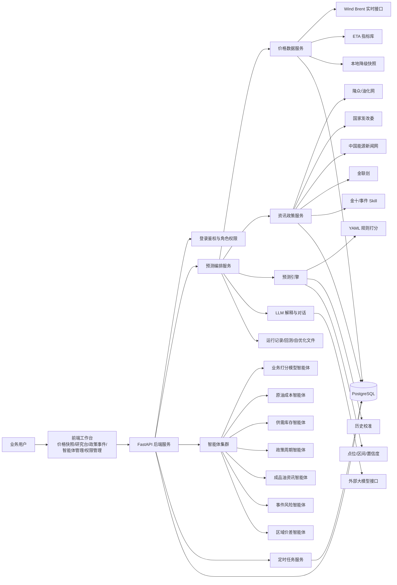

# 成品油研究系统技术架构与服务器资源配置依据

## 1. 系统分层

当前系统采用单机可部署架构，后续可平滑拆分为前端、后端、数据库、任务调度和采集服务。

## 2. 主要服务与资源消耗

| 模块 | 主要职责 | CPU 消耗 | 内存消耗 | 说明 |
|---|---|---:|---:|---|
| FastAPI 后端 | API、权限、预测编排、静态前端服务 | 中 | 中 | 并发请求、预测生成时会同时读取多类数据 |
| PostgreSQL | 用户、权限、资讯、政策、价格快照、晨报缓存 | 中 | 中高 | 如果数据库也放在同一台机器，内存不能太低 |
| 定时任务 | 价格快照、政策资讯、晨报生成 | 中 | 中 | 抓取和晨报生成会形成周期性峰值 |
| 智能体预测 | 多周期 D1/D3/W1/M1、区域价差、因子打分 | 中 | 中 | 多周期和多区域会放大一次请求的计算量 |
| Playwright/浏览器采集 | 金联创等动态页面采集 | 高 | 高 | 浏览器进程是本系统最吃内存的部分之一 |
| LLM 调用 | 对话、研判摘要、经营建议润色 | 低 | 低 | 算力在外部模型侧，本机主要等待网络返回 |
| 前端静态资源 | 首页、智能体管理、政策事件、权限管理 | 低 | 低 | 主要由浏览器承担渲染 |

## 3. 申请 8 核 16G 的依据

建议申请 `8核 CPU / 16GB 内存 / 200GB SSD`，原因如下：

1. 当前部署是“应用 + 数据库 + 定时任务 + 采集任务”同机运行，不只是一个轻量 API。
2. PostgreSQL、FastAPI、定时任务和浏览器采集会同时存在资源峰值。
3. 区域价差预测会同时计算多个区域；多周期改为 D1、D3、W1、M1 后，一次首页刷新会生成多组预测结果。
4. 金联创采集使用 Playwright/Chromium，单次浏览器采集可能额外占用数百 MB 到 1GB 以上内存。
5. 晨报生成、资讯采集、价格快照、用户访问可能在早上集中发生，8核16G可以避免高峰期明显卡顿。
6. 本机作为临时服务器时，还需要给操作系统、防病毒、日志、浏览器进程和数据库缓存预留空间。
